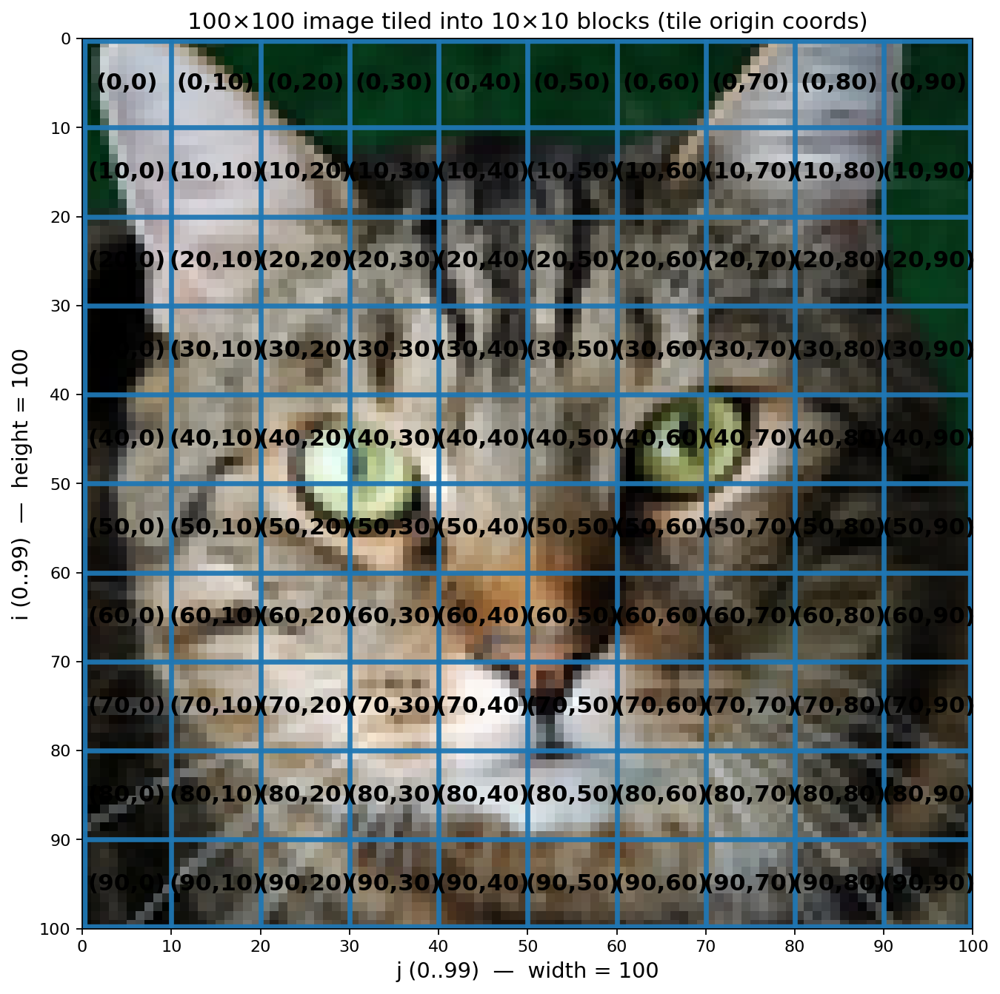

発表構成
======

- 合計持ち時間: 30分
  - Part1: **10分** Introduction: 深層学習のための大規模データ処理
  - Part2: **10分** Background: 計算機を効率良く使うにはどうしたらいいか
  - Part3: **10分** Advanced: Deep Learning Compiler
- 実際にコード動かして遊びたい人へ: https://github.com/hikettei/tiny_polyhedral_compiler/blob/main/examples/polyhedral_compiler.ipynb

<!-- cmd:end_slide -->

[Part1] (1/N) Introduction: 行列演算
====

# 要素ごとの加算 (blas_saxpy where a = 1.0)

Q: 2x2行列`A, B`について，`A[i, j] + B[i, j]`を計算し，その結果を`C[i, j]`に保存するプログラムを考える

<!-- cmd:pause -->

``` python
# Inputs
A = [[1, 2], [3, 4]] # float32
B = [[4, 3], [2, 1]] # float32
C = [[0, 0], [0, 0]] # float32
```

<!-- cmd:pause -->

# 実装例 
<!-- cmd:column_layout: [2, 2, 1] -->
<!-- cmd:column: 0 -->

### Program

```python
for i in range(2):
  for j in range(2):
    C[i, j] = A[i, j] + B[i, j]
# print(C) -> [[5, 5], [5, 5]]
````

<!-- cmd:column: 1 -->

### Schedule

```python
for i in range(2):
  for j in range(2):
    print(f"S({i}, {j})")
```

<!-- cmd:column: 2 -->

### Timestamp

```text
t=0 | S(0, 0)
t=1 | S(0, 1)
t=2 | S(1, 0)
t=3 | S(1, 1)
```

<!-- cmd:reset_layout -->

<!-- cmd:pause -->

- 合計で`2 * 2 = 4`回，計算を実行する `S(i, j): S(0, 0) -> S(0, 1) -> S(1, 0) -> S(1, 1)`
<!-- cmd:pause -->
- 各Statement `S(i, j)`において，こういうことをやってそう:
<!-- cmd:pause -->
  1. `A[i, j]`, `B[i, j]`をメモリからレジスタa/bへロードする (8byte load)
<!-- cmd:pause -->
  2. `a+b`を計算する (1 FLOP)
<!-- cmd:pause -->
  3. (3.)の実行結果を，`C[i, j]`へ保存する (4byte store)
<!-- cmd:pause -->
- [プログラム(Input)] --> [ PC(計算機) ] --> [答え(Output)]
<!-- cmd:end_slide -->
[Part1] (2/N) 計算機 (Memory/ALU)
===

```python
╭Memory────╮  ╭Memory────╮  ╭Memory────╮
│ f =  +   │  │A[i,j] = 1│  │B[i,j] = 4│
╰────┬─────╯  ╰────┬─────╯  ╰────┬─────╯
     │ FETCH inst  │ LOAD 4B     │ LOAD 4B    (total LOAD = 8B)
     │             │             │
     │             │             │
╭ALU─┼─────────────┼─────────────┼──────╮
│    ▼             ▼             ▼      │
│    f             a             b      │     (total FLOP = 1)
│ out = f(a,b) = 5             (1 FLOP) │
╰──┼────────────────────────────────────╯
   │ STORE 4B                               
   │                   
   │        ╭Memory────╮                      (total STORE = 4B)
   └───────▶︎│C[i,j] = 5│
            ╰──────────╯            
(B/F = (LOAD+STORE)/FLOP = 12)
```

計算機を極言すると，以下の三つをするだけのマシン:
<!-- cmd:pause -->
1. **LOAD**: データをメモリから持ってくる。(`total=size_of(float)*n_element*2`)
<!-- cmd:pause -->
2. **ALU**: レジスタ上で命令を演算する。 (1 FLOP)
<!-- cmd:pause -->
3. **STORE**: 結果をメモリへ書き戻す。(`total=size_of(float)*n_element*2`)
<!-- cmd:pause -->
## FLOP, B/F比 (Bytes per FLOP)

- FLOP = 一回の浮動小数点演算の単位
- B/F = メモリ性能(Bandwidth) / ALUを呼び出した回数(FLOPS)

<!-- cmd:end_slide -->
[Part1] (3/N) Modern Processor
====

<!-- cmd:column_layout: [2, 4] -->
<!-- cmd:column: 0 -->

もう少し現代の計算機(e.g.: CPU/GPU/TPU)に近いアーキテクチャを考えてみる。

計算機を構成する要素は，僕は以下の三つだと思う。
(と昔すごい人に教わった)

## Memory

例: HDD/SSD, RAM, VRAM/SRAM, cache
- サイズ: N byte
- 帯域幅: X GB/sec
- エネルギー a pJ/word
- 以下の階層構造で配置する
```
[安くて遅くてでかいメモリ]
         ⇩
[高くて早くて小さいメモリ]
```

<!-- cmd:column: 1 -->

```python
            ╭────────────────────────────────────────────╮
            │ SSD / NVMe (storage)               ~  TB   │
            ╰────────────────────────────────────────────╯
                           ║
                           ║  (I/O)
                           ║
            ╭────────────────────────────────────────────╮
            │ LPDDR / DRAM (main memory)         ~  GB   │
            ╰────────────────────────────────────────────╯

                ╭──────────────────────────────╮
                │ On-chip SRAM (L2/LLC)  ~  MB │
                ╰──────────────────────────────╯

                     ╭──────────────────╮
                     │ Local SRAM ~ KB  │
                     │ (SMEM / REG)     │
                     ╰──────────────────╯
```
<!-- cmd:reset_layout -->
<!-- cmd:end_slide -->

[Part1] (3/N) Modern Processor
======

<!-- cmd:column_layout: [2, 4] -->
<!-- cmd:column: 0 -->

もう少し現代の計算機(e.g.: CPU/GPU/TPU)に近いアーキテクチャを考えてみる。

計算機を構成する要素は，僕は以下の三つだと思う。
(と昔すごい人に教わった)

## Memory

例: HDD/SSD, RAM, VRAM/SRAM, cache
- サイズ: N byte
- 帯域幅: X GB/sec
- エネルギー a pJ/word

## ALU (演算装置)

- Memoryから引っ張ってきた命令(e.g.: Add/Mul/Or)を，Memoryから引っ張ってきたデータに適用する装置
- GPUだと，ALUが大量に並列に並んでたりする

<!-- cmd:column: 1 -->

```python
            ╭────────────────────────────────────────────╮
            │ SSD / NVMe (storage)               ~  TB   │
            ╰────────────────────────────────────────────╯
                           ║
                           ║  (I/O)
                           ║
            ╭────────────────────────────────────────────╮
            │ LPDDR / DRAM (main memory)         ~  GB   │
            ╰────────────────────────────────────────────╯

                ╭──────────────────────────────╮
                │ On-chip SRAM (L2/LLC)  ~  MB │
                ╰──────────────────────────────╯

                     ╭──────────────────╮
                     │ Local SRAM ~ KB  │
                     │ (SMEM / REG)     │
                     ╰──────────────────╯
                           
                           
                        ╭──────╮
                        │ ALU  │
                        │ F(.) │
                        ╰──────╯
```

<!-- cmd:reset_layout -->
<!-- cmd:end_slide -->

[Part1] (3/N) Modern Processor
======

<!-- cmd:column_layout: [2, 4] -->
<!-- cmd:column: 0 -->

もう少し現代の計算機(e.g.: CPU/GPU/TPU)に近いアーキテクチャを考えてみる。

計算機を構成する要素は，僕は以下の三つだと思う。
(と昔すごい人に教わった)

## Memory

例: HDD/SSD, RAM, VRAM/SRAM, cache
- サイズ: N byte
- 帯域幅: X GB/sec
- エネルギー a pJ/word

## ALU (演算装置)

- Memoryから引っ張ってきた命令(e.g.: Add/Mul/Or)を，Memoryから引っ張ってきたデータに適用する装置
- GPUだと，ALUが大量に並列に並んでたりする

## チップ内ネットワーク

- 配置したメモリ/演算装置をどう接続するか
- ここに推論チップの特徴が出る (Cerebrasとか，ロマンがあって個人的に好きです: https://zenn.dev/jnst/articles/cerebras-is-my-fave)

<!-- cmd:column: 1 -->

```python
            ╭────────────────────────────────────────────╮
            │ SSD / NVMe (storage)               ~  TB   │
            ╰────────────────────────────────────────────╯
                           ║
                           ║  (I/O)
                           ║
            ╭────────────────────────────────────────────╮
            │ LPDDR / DRAM (main memory)         ~  GB   │
            ╰────────────────────────────────────────────╯
                           │  640 pJ/word
                           ▼
                ╭──────────────────────────────╮
                │ On-chip SRAM (L2/LLC)  ~  MB │
                ╰──────────────────────────────╯
                           │   50 pJ/word
                           ▼
                     ╭──────────────────╮
                     │ Local SRAM ~ KB  │
                     │ (SMEM / REG)     │
                     ╰──────────────────╯
                           │   5 pJ/word
                           ▼
                        ╭──────╮
                        │ ALU  │
                        │ F(.) │
                        ╰──────╯
```

(Energy numbers are from: https://microarch.org/micro52/media/dally_keynote.pdf)

<!-- cmd:reset_layout -->
<!-- cmd:end_slide -->
[Part1] (4/N) B/F比, Communication is expensive
===

```python
╭───────────────────────────╮  ╭───────────────────────────╮  ╭───────────────────────────╮
│          Integer          │  │            FP             │  │        Memory (64bit)     │
├───────────────────────────┤  ├───────────────────────────┤  ├───────────────────────────┤
│ Add                       │  │ FAdd                      │  │ Cache                     │
│   8  bit   0.03 pJ        │  │   16 bit   0.4 pJ         │  │   8KB      10  pJ         │
│   32 bit   0.1  pJ        │  │   32 bit   0.9 pJ         │  │   32KB     20  pJ         │
│                           │  │                           │  │   1MB      100 pJ         │
│ Mult                      │  │ FMult                     │  │ DRAM    1.3–2.6 nJ        │
│   8  bit   0.2  pJ        │  │   16 bit   1   pJ         │  │                           │
│   32 bit   3    pJ        │  │   32 bit   4   pJ         │  │                           │
╰───────────────────────────╯  ╰───────────────────────────╯  ╰───────────────────────────╯


Instruction Energy Breakdown (example: Add)    total ≈ 70 pJ
╭──────────────────────────────────────────────────────────────────────────────╮
│ I-Cache Access 25pJ │ RegFile Access 6pJ │   Control (rest) ≈ 39pJ   │  Add  │
╰──────────────────────────────────────────────────────────────────────────────╯
        ↑ I-Cache Access         ↑ Register File Access                      ↑ Add
```

- (!!) 「演算」より「データ移動」の方が，エネルギー的にも速度的にも大きい。
<!-- cmd:pause -->
- GPUは，ピーク演算性能に対してDRAM帯域が相対的に小さい。
  - 例: NVIDIA A100 80GBはHBM帯域が約2.0 TB/sで，FP32ピークが約19.5 TFLOP/s よってハードのB/F ≈ 2.0e12 / 19.5e12 ≈ 0.10 byte/FLOP程度 [2]
- つまり，B/Fが0.10より大きいプログラムを書くと「帯域律速」になりやすい。(TODO: Peak performane, rooflineの議論)
<!-- cmd:pause -->
- 例えるなら:
  - 東京から札幌までファーストクラスの飛行機で移動したのに -> (通信)
<!-- cmd:pause -->
  - サイゼだけ食べて速攻帰宅する人 -> (演算)
<!-- cmd:pause -->
  - こういう気持ちでthroughputの議論ではよくB/Fを導入する

(Figures/Numbers are from Mark Horowitz “Computing’s Energy Problem (and what we can do about it)”, ISSCC 2014.)

<!-- cmd:end_slide -->
[Part1] (5/N) Parallelism, CPU/GPU
===

## Parallelism (並列性)

- 前述のB/F比の議論に加え，現代の計算機は並列化をすることでthroughputを向上させようとしている。
- CPU/GPUにも，階層構造で並列性が存在する ([1] Polyhedral Compilation in a Nutshell, Alex Zinenko)
<!-- cmd: pause -->
### CPU (typically 3 levels)

- System threads: `n=1000`件あるデータを, n_cpu_core人で，n_cpu_core分割して，分担する。
- Vector Level: n=250件あるデータを，`(n/simd_width)`人で，`simd_width`分割して，並列化する。(e.g.: `SIMD (Single Instruction Multiple Data)`)
- Instruction Level: 命令レベルパイプライン Overlapを考慮してスケジュールするとか (自分は詳しくないしDL Compilerのレベルでは一般にここまでやらない)
<!-- cmd: pause -->
## GPU (typically 2~8 level)

- 3 x Threads: `n=1000`件あるデータを`block_size`人で`thread_size`分割して，分担する。
- Warps/Vectors: SIMD / Warp / SIMT
- Instruction Level: CPUのと同じ
<!-- cmd:end_slide -->

[Part2] (1/N) 計算機を効率良く扱うためにはどうしたらいいか？
===


# throughput

```python
throughput = achieved FLOP/s
```

Halideの先生曰く，throughputを上げるには，以下の三つを試すしかない (TODO: Source)

<!-- cmd:pause -->
## Amount of data to be applied. (入力するデータの総量)
<!-- cmd:pause -->
- 改善策:
  - アルゴリズムを変える (e.g.: KVCacheを導入する, パラメーター数を見直す)
  - Quantization/Pruningなどを導入する
<!-- cmd:pause -->
## Amount of resources to be applied (費やせるリソースの総量)
<!-- cmd:pause -->
- 改善策:
  - お金を投入して強いGPUをたくさん買う
<!-- cmd:pause -->
## Efficiency of applying them to useful work
<!-- cmd:pause -->
- 改善策: 
  - 効率的に計算機を扱えるプログラムに書き直す。
  - 計算の意味を壊さず，(1.) 通信を最適化し (2.) 適切に並列化した プログラムに書き換える。

<!-- cmd:end_slide -->
[Part2] (2/N) 深層学習で計算機を効率良く扱うにはどうしたらいいか？
===

# A100でDeep Learning ModelをInferenceするとして・・・
<!-- cmd:pause -->
## 仮定

- パラメーターが全てHBMに存在すると仮定する。
- 推論一回ごとにモデルを全パラメーターを読むと仮定すると，パラメーター数をそのままBとすれば良い。
- FLOPSは適当に計算した値を使う。
<!-- cmd:pause -->
## 代表的なモデルのB/F

- ResNet-50 (bfloat16, 224×224，1 image forward)
  - B = 25,557,032 × 2 = 0.0511 GB
  - FLOPs = 4.09 GFLOPs
  - B/F = 0.0511GB / 4.09GF ≈ 0.0125 bytes/FLOP
- GPT-2 (bfloat16, forward, per token inference)
  - B = 124,337,664 × 2 = 0.2487 GB
  - FLOPs = 0.2848 GFLOPs
  - B/F ≈ 0.2487GB / 0.2848GF ≈ 0.873 bytes/FLOP

## Note

- B/Fを下げるには，BatchSizeを上げるという手法がよく挙げられる
- LLM, KVCacheがやかましい
- BytesとFLOPSの両方をバランスよく改善しないといけない。

## Why

- Matmul: `B=O(N^2)/O(N^3), B/F=O(1/N)`
  - ↑は性能を出しやすい (速度が出ないのは，プログラムが悪いから) = Compute Bound
- Activation/LayerNorm/Softmax: `B=O(N)/O(N)` B/F=O(1.0)`
  - ↑は性能を出しにくい (速度が出ないのは，ハードウェアが悪いから) = Memory Bound

<!-- cmd:end_slide -->
[Part2] (3/N) What is tile?
===
例: 100x100の2次元の画像を処理する行列演算を考える。

<!-- cmd:column_layout: [1, 1] -->
<!-- cmd:column: 0 -->

``` python
# Before Tiling
for i in range(100):
  for j in range(100):
    S(i, j)
# ⇩ 全く同じ意味のプログラムに書き換える
# After Tiling
for i_outer in range(10):    # } Outer
  for j_outer in range(10):  # } Outer
    for i_inner in range(10):    # } Inner
      for j_inner in range(10):  # } Inner
        S(10*i_outer+i_inner, 10*j_outer+j_inner)
```

<!-- cmd:column: 1 -->



(https://salient-imagenet.cs.umd.edu/explore/class_281/feature_309.html)

<!-- cmd:reset_layout -->

- 便利なのでTileというループ変形を導入する:
  - e.g.: 100x100の画像について，10x10の小さい正方形(Tile)を作成して，Tileごとに計算をする
  - Tileは1次元，2次元，n次元の座標系で存在する。
- 並列性とは: 互いに依存のないn件のデータをk人で分割してシャッフルして同時並行に処理すること。(n > k)

<!-- cmd:end_slide -->
[Part2] (4/N) Memory Locality効率化 (Cache)
===

1回通信すると10回計算で利用される (理想論)
実際には，SRAMのようなメモリ容量は小さい :(
だから，Cacheして，理論値のB/Fに近づけないといけない。

Compute-Boundな演算に対して，Tilingは効率的に動作する
<!-- cmd:end_slide -->
[Part2] (4/N) 並列化 (Loop Parallelize for CPU)
===
各タイルについて，並列化を割り当てる
(TODO: Polyhedral Compilerを用いて説明する)
<!-- cmd:end_slide -->

[Part2] (5/N) 並列化 (Loop Parallelize for GPU)
===
各タイルについてBlock/Threadを割り当てる
(TODO: Polyhedral Compilerを用いて説明する)

<!-- cmd:end_slide -->
[Part2] (6/N) 並列化 (Strip-Mine, SIMD)
===
各タイルについて，内側のBankをSinkする(Strip-Mine)
(SIMT, Warp)
TensorCore: 4x4 TileとかでA@B=Cを計算する
<!-- cmd:end_slide -->
[Part2] (7/N) Memory Locality効率化 (Loop Coalesce)
===

``` python
for i in range(10):
  for j in range(10):
    S(i, j)
<=>
for i in range(10*10):
  S(i mod 10, i // 10)
```
(適当なスライドを持ってくる)

<!-- cmd:end_slide -->
[Part2] (9/N) Memory Locality効率化 (Interchange)
===
Conv2D NCHW -> NCWH Transformation

<!-- cmd:end_slide -->
[Part2] (10/N) Memory Locality効率化 (Loop Fusion)
===
- Loop Fusion (TODO: 根拠の論文を持ってくる) Which is NP-Hard problem to optimize.
  - 応用: On-the-fly reduction, FlashAttention (ざっくり言えば，Matmul+Softmax+Matmulを全てLoop Fusionした形として説明できる，Softmax安定化のコード変形に目を瞑れば)
- FlashAttention, ComputeBoundな演算とMemoryBoundな演算を一つのカーネルへ融合することで，ComputeBoundな演算に書き換え，B/Fを小さくする，といった説明ができる。
- そのほかでメモリ帯域幅の性能を改善する方法といえば，Prefetchとか，128bit loadingとか，

<!-- cmd:end_slide -->
[Part2] (11/N) Memory Locality効率化 (Loop Skewing)
===
- Stencil/Skewing (NxMの領域を三角形のタイルで埋めていく，論文どこいったっけ)

<!-- cmd:end_slide -->
[Part3] (1/N) 並列計算のためのプログラミング言語 (DSL)
====

``` python
╭────────────── ALU ───────────────────╮
│ y = f( DATA1[ g(i) ] , DATA2[ g(j) ])│
╰───▲───────────▲───────────▲──────────╯
    │           │           │
    │           │           └─ data2 (tensor / memory), accessed at g(j)
    │           └───────────── data1 (tensor / memory), accessed at g(i)
    └───────────────────────── f : algorithm to apply
```

``` python
╭─────────────── memory ──────────────────╮
│ Addr : 0   1   2   3   4   5   …        │
│ Val  : x0  x1  x2  x3  x4  x5  …        │
╰─────────────────────────────────────────╯
               ▲
            k = g(i)
```

<!-- cmd:pause -->
# プログラムは，以下の3つの要素から構成される
<!-- cmd:pause -->
- `DATA`: 計算したいデータがある (e.g.: NN Parameter Weight, 口座残高，年齢，etc ...)
  - データ型: char, float32, bfloat16, float8, int4, ...
  - データ量: `[M, N]行列`
  - 総データ量: `(M*N*size_of(float))bytes`
<!-- cmd:pause -->
- `g(i)`: メモリからデータをどういう順番で読むか？ (e.g.: ランダムアクセス，規則的)
  - 例: `g(i, j) = 4i+j (Strided-Array)`, `g(i) = random(0, 4)` 
  - Deep Learningで用いるアルゴリズムの95%は，f(i)がQuasiaffine関数であることが知られている (TODO: SOurce)
  - (注: Quasiaffine, fがPresburger算術のclass, 要は+と*のみで表記できるaffineな関数)
<!-- cmd:pause -->
- `f`: 読んだデータに対してどういう処理をするか？(e.g.: `+`, `*`, `replace`) (1 FLOP)

<!-- cmd:end_slide -->

[Part3] (2/N) 並列計算のためのプログラミング言語 (DSL)
====

前述のモデルでいうと，深層学習の計算はかなり規則的な形に落ちやすい。(TODO: これスライドの最後に持ってくか？)

``` python
深層学習でよくやる計算の例:

[GEMM]
  C[m,n] = sum_k A[m,k] * B[k,n]

[Conv2D (NCHW, simplified)]
  O[n,co,ho,wo] = sum_{ci,kh,kw} I[n,ci,ho+kh,wo+kw] * W[co,ci,kh,kw]

[Pooling (MaxPool, simplified)]
  O[n,c,ho,wo] = max_{kh,kw} I[n,c,ho+kh,wo+kw]
  
[Attention (naive, per-head)]
  S[i,j] = Q[i,:] · K[j,:]
  P[i,j] = softmax_j S[i,j]
  O[i,:] = sum_j P[i,j] * V[j,:]
```

- 流れるデータ量は，事前にわかっている。(Offine Optimization)
- 計算グラフは，コンパイル前に固定である (SCoP)
- Deep Learningの場合，メモリアクセスパターンはとっても単純
  - 調査によれば，ほとんど全てのHPC KernelはAffineである (Paul Feautrier. 1991. Dataflow analysis of array and scalar references. Int. J. Parallel Program. 20, 1 (1991), 23ś53. https://doi.org/10.1007/ BF01407931)
  - 経験則で言えば，99%のDeep Learning Kernelのメモリ通信はReduction, Broadcast, ElementWise

<!-- cmd:end_slide -->
[Part3] (3/N) Deep Learning Compiler
======

(Disclaimer: この部分は本当にいろんなアプローチがあります。Halide, Tiramisu, Polyhedral Model, Tinygrad, E-Graph and Equality Saturation, etc ...)

- 計算機を効率良く扱うには，二つのアプローチがある。
  - ハードウェア側を最適化する (クロック数を上げる，プロセスルール微細化，Systolic Array, ...)
  - ソフトウェア側を最適化する (前述の最適化をうまく使ったコードを生成する)
- 自分はソフトウェア側を最適化したいと思った。
- Compiler:
``` python
unoptimized code -> [compiler] -> optimized code
    ↑                                  ↑
    ------------------------------------
     Problem: この過程で，コードが正しいことをどうやって保証するか？
```
<!-- cmd:end_slide -->

[Part3] (4/N) Schedule and Algoritm Separation, DSL
===

- よくないやり方？:
  - 一つのプログラミング言語で，計算の意味と最適化を両方一気にやる 
- 二つのプログラミング言語に分割する:
  - 計算の意味を記述する言語 (e.g.: AとBの行列積を取って，sigmoid関数を適用して。。。)
  - 上記のプログラムを最適化する言語 (e.g.: 一つ目のループを並列化して，次のループをタイルして，...)
- Example
- 先行研究: BEAM Search, Ansor, AutoTVM, Tinygrad, Luminal, XLA, 

次に読むと面白いかもしれない文献
CUDAで最高速度のGemmを書くBlog
<!-- cmd:end_slide -->
[Part3] (5/N) Conclusion? TinygradでMetal Gemmを書いてみる
===

Tinykitten, Tinygrad BEAM Search
TODO: ここでBEAM Searchを実演する

自分のスペックだと，M3 Pro Macだと，B/Fがaで，大体xGFLOPSくらいは出そう

<!-- cmd:end_slide -->

参考文献
======

- [1] https://pliss2019.github.io/albert_cohen_slides.pdf
- [2] https://www.nvidia.com/content/dam/en-zz/Solutions/Data-Center/a100/pdf/nvidia-a100-datasheet-nvidia-us-2188504-web.pdf
- https://microarch.org/micro52/media/dally_keynote.pdf
- https://www.slideshare.net/slideshow/introduction-to-polyhedral-compilation/70482946
- https://pliss2019.github.io/albert_cohen_slides.pdf

<!-- cmd:end_slide -->
